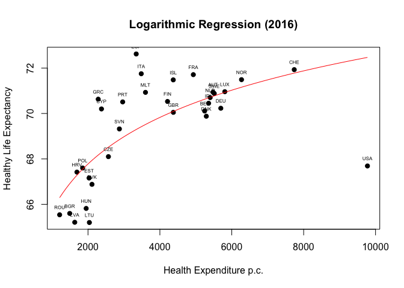
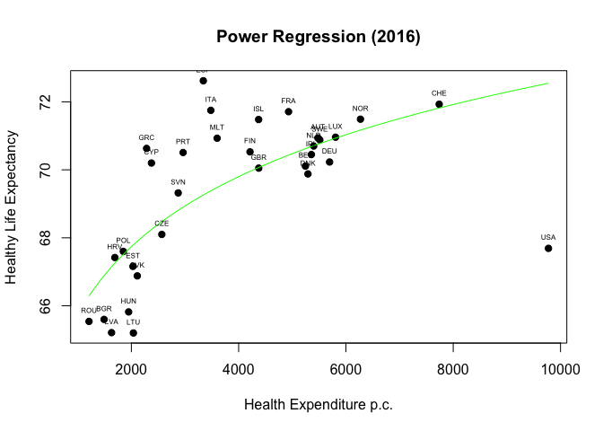
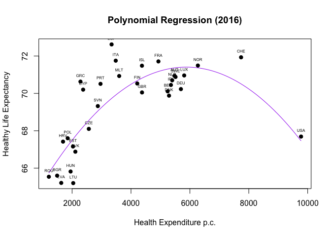

Macro-statistics_Health LIfe Expectancy vs Per Capita Health Expenditure
================
2025-07-06

# R Notebook

# Exploring the link between health spending and healthy life expectancy (2000 vs 2016);

# This notebook reads an Excel file containing cross-country data on per capita health-care expenditure and healthy life expectancy;

# It isolates two benchmark years (2000 and 2016);

# It computes basic descriptive statistics and Pearson correlations for each year;

# It fits four functional forms for 2016—simple linear, logarithmic, power (log–log) and second-degree polynomial—then compares them via R²;

# It visualises the results with scatterplots overlaid with fitted curves and country codes;

# The goal is to see how strongly, and in what functional form, health spending per head explains cross-country differences in healthy life expectancy, and whether that relationship changed between 2000 and 2016.

# 1. Import packages and file excel

# 1.2 Import packages to read excel

``` r
library(readxl)
```

# 1.3 Import file excel

``` r
df <- read_excel("/Users/lorenzomazzolli/Desktop/24OREBS/SQL_R_PYTHON/EXCEL/File_Healthy_Life_Expectancy_Health_Expenditure_Filtered.xlsx", sheet = "Healthy_life exp_Health_Exp.")
```

# 2. Filter data, extract DataFrame and variables for each year considered

# 2.1 Filter data for reference years

``` r
df_2000 <- subset(df, Year == 2000)
df_2016 <- subset(df, Year == 2016)
```

# 2.2 Extract X and Y variables for 2000

``` r
X_2000 <- df_2000$Health_exp_pc
Y_2000 <- df_2000$Healthy_life_exp
```

# 2.3 Extract X and Y variables for 2016

``` r
X_2016 <- df_2016$Health_exp_pc
Y_2016 <- df_2016$Healthy_life_exp
```

# 3. Calculate basic descriptive statistics for each year considered

# 3.1 Basic statistics for 2000

``` r
mean_X_2000 <- mean(X_2000, na.rm = TRUE) # remove NAs
mean_Y_2000 <- mean(Y_2000, na.rm = TRUE)
std_X_2000 <- sd(X_2000, na.rm = TRUE)
std_Y_2000 <- sd(Y_2000, na.rm = TRUE)
CV_X_2000 <- std_X_2000/mean_X_2000
CV_Y_2000 <- std_Y_2000/mean_Y_2000
```

# 3.2 Basic statistics for 2016

``` r
mean_X_2016 <- mean(X_2016, na.rm = TRUE)
mean_Y_2016 <- mean(Y_2016, na.rm = TRUE)
std_X_2016 <- sd(X_2016, na.rm = TRUE)
std_Y_2016 <- sd(Y_2016, na.rm = TRUE)
CV_X_2016 <- std_X_2016/mean_X_2016
CV_Y_2016 <- std_Y_2016/mean_Y_2016
```

# 3.3 Correlations

``` r
correlation_2000 <- cor(X_2000, Y_2000, use = "complete.obs") # use complete observations only
correlation_2016 <- cor(X_2016, Y_2016, use = "complete.obs")
```

# 3.4 Print basic statistics for 2000

``` r
cat("=== Basic Statistics for Year 2000 ===\n")
```

    ## === Basic Statistics for Year 2000 ===

``` r
cat("Mean Health Expenditure p.c.:",        mean_X_2000, "\n") # new-line character. Inside strings it tells R to start a new lin
```

    ## Mean Health Expenditure p.c.: 1734.922

``` r
cat("Mean Healthy Life Expectancy:",   mean_Y_2000, "\n")
```

    ## Mean Healthy Life Expectancy: 66.48406

``` r
cat("Std Dev Health Expenditure p.c.:",     std_X_2000,  "\n")
```

    ## Std Dev Health Expenditure p.c.: 1043.844

``` r
cat("Std Dev Healthy Life Expectancy:",std_Y_2000,  "\n")
```

    ## Std Dev Healthy Life Expectancy: 2.540019

``` r
cat("Coefficient of variation Health Expenditure p.c.:",CV_X_2000,  "\n")
```

    ## Coefficient of variation Health Expenditure p.c.: 0.6016662

``` r
cat("Coefficient of variation Healthy Life Expectancy:",CV_Y_2000,  "\n")
```

    ## Coefficient of variation Healthy Life Expectancy: 0.03820493

``` r
cat("Correlation (2000):",             correlation_2000, "\n\n")
```

    ## Correlation (2000): 0.709052

# 3.5 Print basic statistics for 2016

``` r
cat("=== Basic Statistics for Year 2016 ===\n")
```

    ## === Basic Statistics for Year 2016 ===

``` r
cat("Mean Health Expenditure p.c.:",        mean_X_2016, "\n")
```

    ## Mean Health Expenditure p.c.: 3904.654

``` r
cat("Mean Healthy Life Expectancy:",   mean_Y_2016, "\n")
```

    ## Mean Healthy Life Expectancy: 69.36

``` r
cat("Std Dev Health Expenditure p.c.:",     std_X_2016,  "\n")
```

    ## Std Dev Health Expenditure p.c.: 2023.865

``` r
cat("Std Dev Healthy Life Expectancy:",std_Y_2016,  "\n")
```

    ## Std Dev Healthy Life Expectancy: 2.239016

``` r
cat("Coefficient of variation Health Expenditure p.c.:",CV_X_2016,  "\n")
```

    ## Coefficient of variation Health Expenditure p.c.: 0.5183213

``` r
cat("Coefficient of variation Healthy Life Expectancy:",CV_Y_2016,  "\n")
```

    ## Coefficient of variation Healthy Life Expectancy: 0.03228109

``` r
cat("Correlation (2016):",             correlation_2016, "\n\n")
```

    ## Correlation (2016): 0.5549426

# 4. Calculate Regression for 2016

# 4.1 Simple linear regression (Y = a + bX)

``` r
model_linear_2016 <- lm(Y_2016 ~ X_2016)
```

# 4.2 Logarithmic regression (Y = a + b\*log(X))

``` r
model_log_2016    <- lm(Y_2016 ~ log(X_2016))
```

# 4.3 Power regression (log(Y) = a + b*log(X) → Y = a * X^b)

``` r
model_power_2016  <- lm(log(Y_2016) ~ log(X_2016))
```

# 4.4 Second-degree polynomial regression (Y = a + b1*X + b2*X²)

``` r
model_poly_2016   <- lm(Y_2016 ~ X_2016 + I(X_2016^2))
```

# 4.5 Collect and print regression summaries

``` r
summary_linear_2016 <- summary(model_linear_2016)
summary_log_2016    <- summary(model_log_2016)
summary_power_2016  <- summary(model_power_2016)
summary_poly_2016   <- summary(model_poly_2016)

cat("=== Simple Linear Regression (Y ~ X) for 2016 ===\n")
```

    ## === Simple Linear Regression (Y ~ X) for 2016 ===

``` r
cat("R^2:",  summary_linear_2016$r.squared, "\n")
```

    ## R^2: 0.3079613

``` r
cat("=== Logarithmic Regression (Y ~ log(X)) for 2016 ===\n")
```

    ## === Logarithmic Regression (Y ~ log(X)) for 2016 ===

``` r
cat("R^2:",  summary_log_2016$r.squared, "\n")
```

    ## R^2: 0.5015642

``` r
cat("=== Power Regression (log(Y) ~ log(X)) for 2016 ===\n")
```

    ## === Power Regression (log(Y) ~ log(X)) for 2016 ===

``` r
cat("R^2:",  summary_power_2016$r.squared, "\n")
```

    ## R^2: 0.5041317

``` r
cat("=== Polynomial Regression (Y ~ X + X^2) for 2016 ===\n")
```

    ## === Polynomial Regression (Y ~ X + X^2) for 2016 ===

``` r
cat("R^2:",  summary_poly_2016$r.squared, "\n")
```

    ## R^2: 0.6937731

# 5. Scatter plots with regression curves (base R)

``` r
Country_Code_2016 <- df_2016$Country_Code
par(mfrow = c(2, 2))  # splits the plotting device into a grid of 2 rows × 2 columns. The next four plots appear in that grid, filling positions row-wise.
```

# 5.1 Simple Linear

``` r
plot(X_2016, Y_2016,
     main = "Simple Linear Regression (2016)",
     xlab = "Health Expenditure p.c.",
     ylab = "Healthy Life Expectancy",
     pch  = 19)
abline(model_linear_2016, col = "blue")
text(X_2016, Y_2016, labels = Country_Code_2016, pos = 3, cex = .5)
```

<!-- -->

# 5.2 Logarithmic

``` r
plot(X_2016, Y_2016,
     main = "Logarithmic Regression (2016)",
     xlab = "Health Expenditure p.c.",
     ylab = "Healthy Life Expectancy",
     pch  = 19)
curve(coef(model_log_2016)[1] + coef(model_log_2016)[2] * log(x),
      add = TRUE, col = "red")
text(X_2016, Y_2016, labels = Country_Code_2016, pos = 3, cex = .5)
```

<!-- -->

# 5.3 Power

``` r
plot(X_2016, Y_2016,
     main = "Power Regression (2016)",
     xlab = "Health Expenditure p.c.",
     ylab = "Healthy Life Expectancy",
     pch  = 19)
curve(exp(coef(model_power_2016)[1]) * x^coef(model_power_2016)[2],
      add = TRUE, col = "green")
text(X_2016, Y_2016, labels = Country_Code_2016, pos = 3, cex = .5)
```

<!-- -->

# 5.4 Polynomial

``` r
plot(X_2016, Y_2016,
     main = "Polynomial Regression (2016)",
     xlab = "Health Expenditure p.c.",
     ylab = "Healthy Life Expectancy",
     pch  = 19)
curve(coef(model_poly_2016)[1] +
        coef(model_poly_2016)[2] * x +
        coef(model_poly_2016)[3] * x^2,
      add = TRUE, col = "purple")
text(X_2016, Y_2016, labels = Country_Code_2016, pos = 3, cex = .5)
```

<!-- -->

# 5.5 ggplot2 versions with labels

``` r
plot_linear <- ggplot(df_2016, aes(Health_exp_pc, Healthy_life_exp)) +
  geom_point() +
  geom_smooth(method = "lm", se = FALSE, color = "blue") +
  geom_text_repel(aes(label = Country_Code_2016), size = 2, max.overlaps = 15) +
  labs(title = "Simple Linear Regression (2016)",
       x = "Health Expenditure p.c.",
       y = "Healthy Life Expectancy")
```

``` r
plot_log <- ggplot(df_2016, aes(Health_exp_pc, Healthy_life_exp)) +
  geom_point() +
  geom_smooth(method = "lm", formula = y ~ log(x), se = FALSE, color = "red") +
  geom_text_repel(aes(label = Country_Code_2016), size = 2, max.overlaps = 15) +
  labs(title = "Logarithmic Regression (2016)",
       x = "Health Expenditure p.c.",
       y = "Healthy Life Expectancy")
```

``` r
plot_power <- ggplot(df_2016, aes(Health_exp_pc, Healthy_life_exp)) +
  geom_point() +
  geom_smooth(method = "lm", formula = y ~ poly(log(x), 1),
              se = FALSE, color = "green") +
  geom_text_repel(aes(label = Country_Code_2016), size = 2, max.overlaps = 15) +
  labs(title = "Power Regression (2016)",
       x = "Health Expenditure p.c.",
       y = "Healthy Life Expectancy")
```

``` r
plot_poly <- ggplot(df_2016, aes(Health_exp_pc, Healthy_life_exp)) +
  geom_point() +
  geom_smooth(method = "lm", formula = y ~ poly(x, 2),
              se = FALSE, color = "purple") +
  geom_text_repel(aes(label = Country_Code_2016), size = 2, max.overlaps = 15) +
  labs(title = "Polynomial Regression (2016)",
       x = "Health Expenditure p.c.",
       y = "Healthy Life Expectancy")
```

``` r
grid.arrange(plot_linear, plot_log, plot_power, plot_poly, nrow = 2, ncol = 2)
```

    ## `geom_smooth()` using formula = 'y ~ x'

<!-- -->
